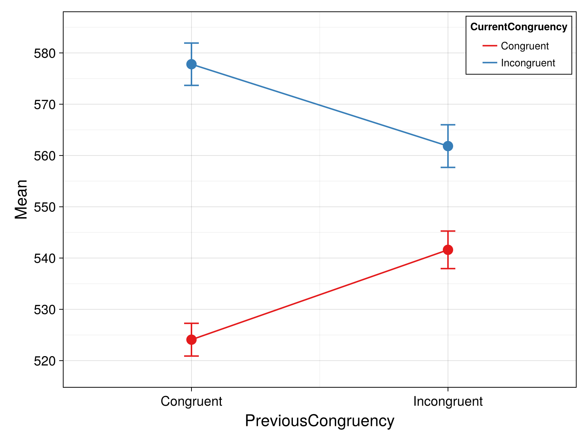
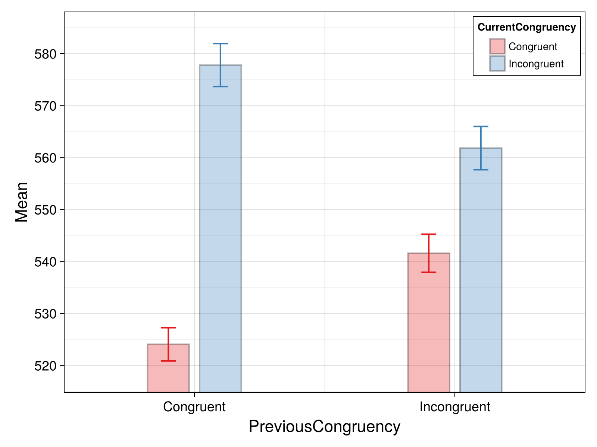
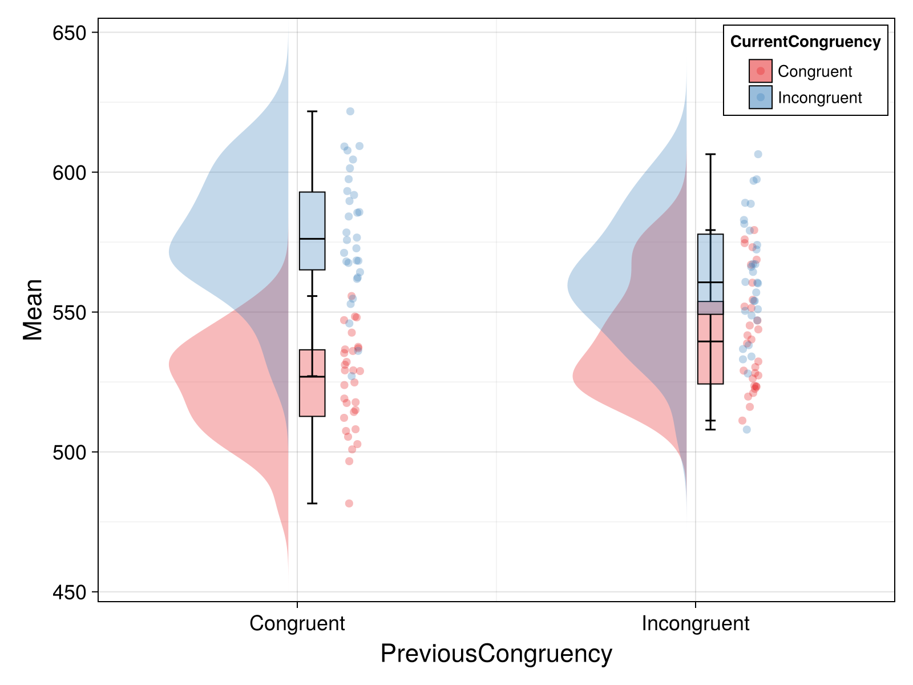
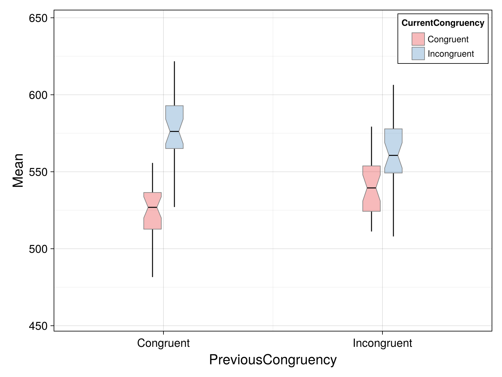
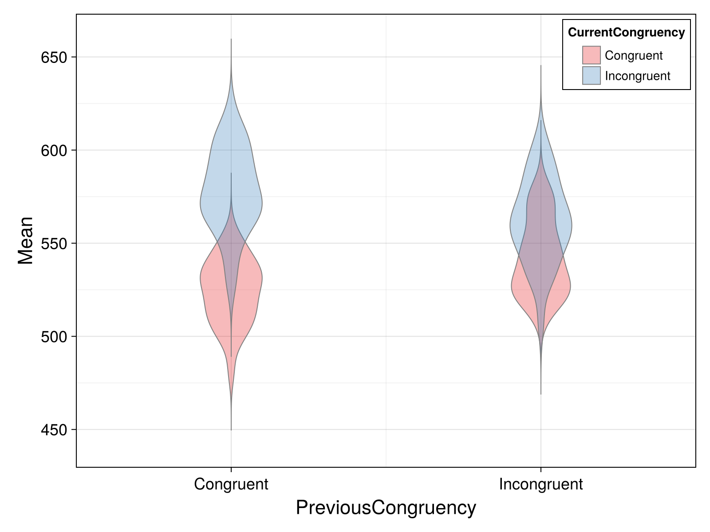
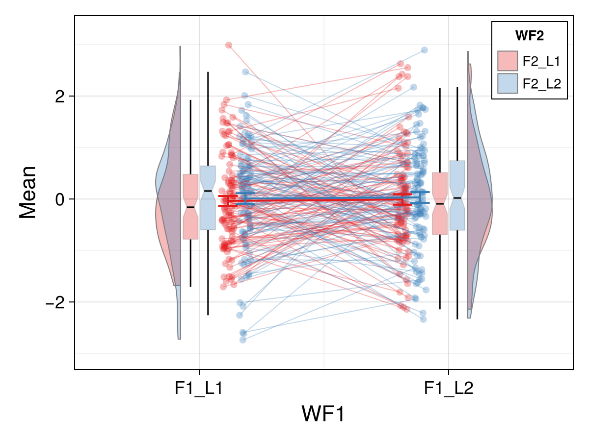
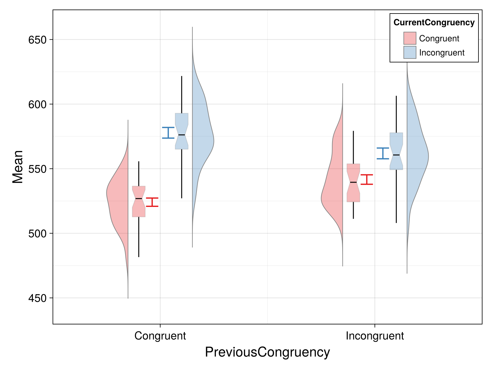
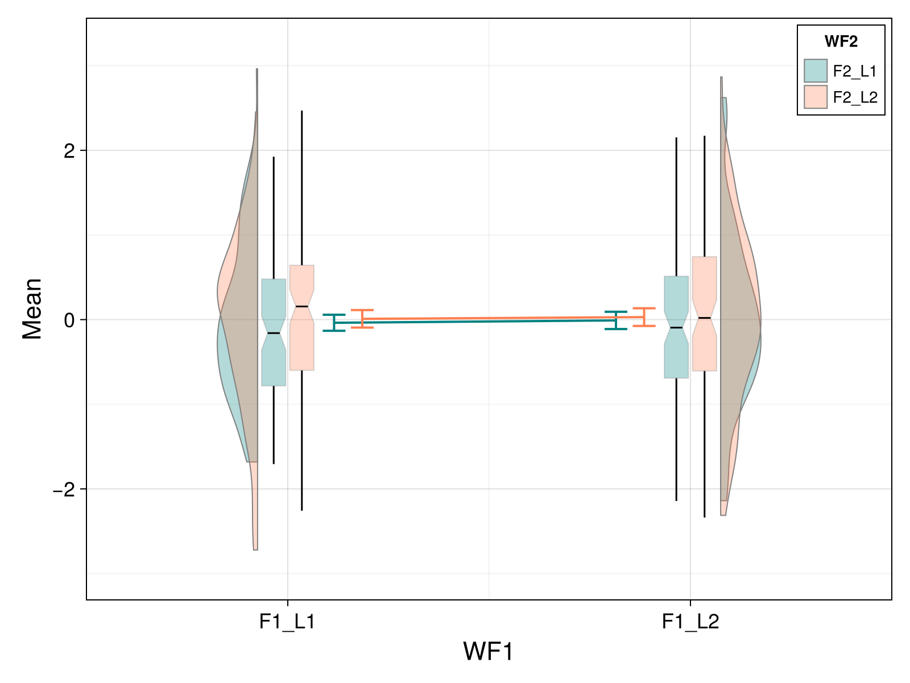
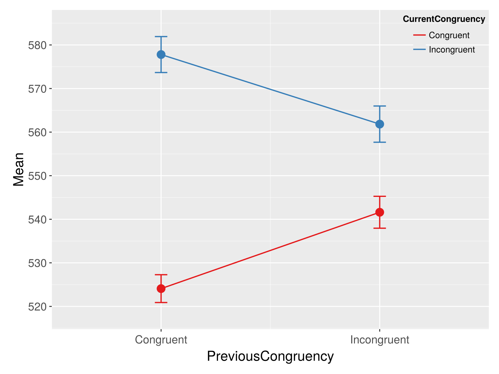
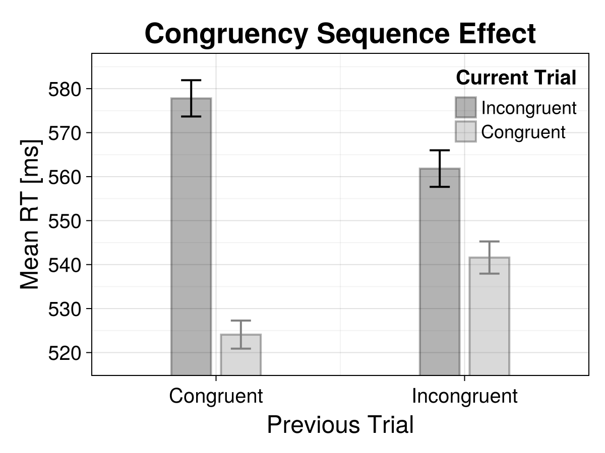

# AnovaFun.jl

[](https://igmmgi.github.io/AnovaFun.jl/)
[](https://github.com/igmmgi/AnovaFun.jl/actions)
[](https://github.com/igmmgi/AnovaFun.jl/actions)
[](https://opensource.org/licenses/MIT)
[](https://doi.org/10.5281/zenodo.18139228)

A Julia package for analysis of factorial experiments, including repeated measures (within-subjects), between-subjects, and mixed designs, inspired by the R packages afex, ez and emmeans.

**Note**: This package implements a subset of features from the above packages, focused on common ANOVA analyses. It has been tested, albeit not exhaustively, against R's aov, ezANOVA, afex, emmeans, and JASP's ANOVA interface.

## Features

- **Between-subjects ANOVA** - Compare groups across independent subjects
- **Within-subjects (Repeated Measures) ANOVA** - Compare conditions within the same subjects
- **Mixed-design ANOVA** - Combine between and within factors
- **Estimated Marginal Means (emmeans)** - Calculate marginal means with confidence intervals
- **Pairwise Comparisons** - Post-hoc tests with multiple comparison adjustments
- **Sphericity Corrections** - Greenhouse-Geisser and Huynh-Feldt corrections
- **Effect Sizes** - η² (eta squared), partial η², and ω² (omega squared)
- **Power Analysis** - Simulation-based power analysis
- **Basic Plots** - Interactive plots via GLMakie or publication quality outputs via CairoMakie for ANOVA/emmeans results
- **Output** - APA formatted tables and stats to latex, markdown, or text via PrettyTables

## Installation

```julia
using Pkg
Pkg.add("AnovaFun")
```

## Quick Reference

### Basic ANOVA Syntax

```julia
# Between-subjects ANOVA
result = anova(data, :dv, :subject, between = [:factor1, :factor2])

# Within-subjects ANOVA
result = anova(data, :dv, :subject, within = [:factor1, :factor2])

# Mixed-design ANOVA
result = anova(data, :dv, :subject, between = [:between_factor], within = [:within_factor])
```

### Common Plot Options

```julia
# Basic line plot
plot_anova(result, x_grouping = :factor1, y_grouping = :factor2)

# With faceting
plot_anova(result, x_grouping = :factor1, y_grouping = :factor2, facet_cols = :factor3)

# Plot types: :line, :bar, :violin, :boxplot, :raincloud, and custom raincloud types
# Themes changes available via Makie themes

```

## Complete Example:

### 2 x 2 Within-Subjects Congruency Sequence Effect (CSE)

#### Step 1: Load and Preview Data

```julia
using AnovaFun, DataFrames, CSV

# Load/create your dataset (long format)
# Example: data = CSV.read("path/to/your/data.csv", DataFrame)
data = CSV.read("path/to/data.csv", DataFrame)

# Preview the first few rows
first(data, 10)
```

| Subject | PreviousCongruency | CurrentCongruency | RT     |
| ------- | ------------------ | ----------------- | ------ |
| 1       | Congruent          | Congruent         | 523.9  |
| 1       | Congruent          | Incongruent       | 576.62 |
| 1       | Incongruent        | Congruent         | 545.2  |
| 1       | Incongruent        | Incongruent       | 567.1  |
| 2       | Congruent          | Congruent         | 537.54 |
| 2       | Congruent          | Incongruent       | 609.34 |
| 2       | Incongruent        | Congruent         | 519.78 |
| 2       | Incongruent        | Incongruent       | 548.78 |

**Dataset Summary:**

- **N = 30 subjects** (each completing all conditions)
- **Design**: 2×2 within-subjects (PreviousCongruency × CurrentCongruency)
- **Dependent Variable**: Reaction time (RT)
- **Total observations**: 120 (30 subjects × 4 conditions)

#### Step 2: Run the ANOVA

```julia
# Run 2×2 within-subjects ANOVA
result = anova(data, :RT, :Subject, within = [:PreviousCongruency, :CurrentCongruency])
```

#### Step 3: View ANOVA Results

```julia
result # default show method
result.table # for full anove table
```

| Effect                                 | DFn | DFd | F      | p      | sig¹   | η²ₚ   |
| -------------------------------------- | --- | --- | ------ | ------ | ------ | ----- |
| PreviousCongruency                     | 1   | 29  | 0.04   | 0.838  | n.s.   | 0.001 |
| CurrentCongruency                      | 1   | 29  | 103.34 | < .001 | \*\*\* | 0.781 |
| PreviousCongruency × CurrentCongruency | 1   | 29  | 17.68  | < .001 | \*\*\* | 0.379 |

¹: \* = p < .05, ** = p < .01, \*** = p < .001, n.s. = not significant

#### Step 4: Estimated Marginal Means

```julia
# Calculate estimated marginal means for all effects
result_emm = emmeans(result)
```

| Effect                                 | Level                    | N   | Mean   | SE   | Lower  | Upper  | error |
| -------------------------------------- | ------------------------ | --- | ------ | ---- | ------ | ------ | ----- |
| Grand Mean                             | Overall                  | 30  | 551.33 | 3.73 | 543.7  | 558.96 | 3.73  |
| PreviousCongruency                     | Congruent                | 30  | 550.94 | 3.80 | 543.2  | 558.68 | 3.80  |
| PreviousCongruency                     | Incongruent              | 30  | 551.72 | 3.80 | 543.98 | 559.46 | 3.80  |
| CurrentCongruency                      | Congruent                | 30  | 532.85 | 3.80 | 525.11 | 540.59 | 3.80  |
| CurrentCongruency                      | Incongruent              | 30  | 569.82 | 3.80 | 562.08 | 577.56 | 3.80  |
| PreviousCongruency × CurrentCongruency | Congruent, Congruent     | 30  | 524.08 | 5.37 | 513.1  | 535.06 | 5.37  |
| PreviousCongruency × CurrentCongruency | Congruent, Incongruent   | 30  | 577.80 | 5.37 | 566.82 | 588.78 | 5.37  |
| PreviousCongruency × CurrentCongruency | Incongruent, Congruent   | 30  | 541.61 | 5.37 | 530.63 | 552.59 | 5.37  |
| PreviousCongruency × CurrentCongruency | Incongruent, Incongruent | 30  | 561.83 | 5.37 | 550.85 | 572.81 | 5.37  |

### Step 5: Create Plots

```julia
# Line plot showing the interaction
plot_anova(result,
           x_grouping = :CurrentCongruency,
           y_grouping = :PreviousCongruency,
           plot_type = :line)

# Bar plot with error bars
plot_anova(result,
           x_grouping = :CurrentCongruency,
           y_grouping = :PreviousCongruency,
           plot_type = :bar,
           errorbars = :SE)

# Raincloud plot showing data distributions
plot_anova(result,
           x_grouping = :CurrentCongruency,
           y_grouping = :PreviousCongruency,
           plot_type = :raincloud)

```

### Plot Examples

#### Line Plot

```julia
# Basic line plot
plot_anova(result,
           x_grouping = :CurrentCongruency,
           y_grouping = :PreviousCongruency,
           plot_type = :line)
```



#### Bar Plot

```julia
# Bar plot with error bars
plot_anova(result,
           x_grouping = :CurrentCongruency,
           y_grouping = :PreviousCongruency,
           plot_type = :bar,
           errorbars = :SE)
```



#### Raincloud Plot

```julia
# Raincloud plot with distributions and points
plot_anova(result,
           x_grouping = :CurrentCongruency,
           y_grouping = :PreviousCongruency,
           plot_type = :raincloud)
```



#### Box Plot

```julia
# Box plot showing distributions
plot_anova(result,
           x_grouping = :CurrentCongruency,
           y_grouping = :PreviousCongruency,
           plot_type = :boxplot)
```



#### Violin Plot

```julia
# Violin plot with density estimates
plot_anova(result,
           x_grouping = :CurrentCongruency,
           y_grouping = :PreviousCongruency,
           plot_type = :violin)
```



#### Custom Raincloud Plot with Connected Individual Points

```julia
# Custom raincloud with connected individual points
plot_anova(result,
           x_grouping = :CurrentCongruency,
           y_grouping = :PreviousCongruency,
           plot_type = :raincloud_custom_2x2,
           connected_points = true)
```



#### Custom Raincloud Plot

```julia
# Additional custom raincloud configuration
plot_anova(result,
           x_grouping = :CurrentCongruency,
           y_grouping = :PreviousCongruency,
           plot_type = :raincloud_custom)
```



#### Custom Theme Examples

##### Basic Custom Themes

```julia
# Custom theme with teal/coral colors
custom_theme = Theme(
    palette = (color = [:teal, :coral],)
)

fig = plot_anova(result,
    x_grouping = :WF1,
    y_grouping = :WF2,
    plot_type = :raincloud_custom_2x2,
    theme = custom_theme
)
```



```julia
# Using Makie's built-in ggplot2 theme
fig = plot_anova(result,
    x_grouping = :PreviousCongruency,
    y_grouping = :CurrentCongruency,
    plot_type = :line,
    theme = theme_ggplot2()
)
```



```julia
custom_theme = Theme(
    palette = (color = [:black, :grey],),
    Axis = (
        xlabelsize = 24,
        ylabelsize = 24,
        xticklabelsize = 20,
        yticklabelsize = 20,
        titlesize = 28
    ),
    Legend = (
        labelsize = 18,
        titlesize = 20
    )
)

fig = plot_anova(result,
    x_grouping = :PreviousCongruency,
    y_grouping = :CurrentCongruency,
    plot_type = :bar,
    theme = custom_theme,
    axis_title = "Congruency Sequence Effect",
    axis_xlabel = "Previous Trial",
    axis_ylabel = "Mean RT [ms]",
    legend_title = "Current Trial",
    legend_framevisible = false,
    legend_order = [:Incongruent, :Congruent]
)
```



## Citation

If you use AnovaFun.jl in your research, please cite it:

```bibtex
@software{mackenzie2026anovafun,
  author    = {Mackenzie, Ian G. M. and Sonntag, Samuel and Dudschig, Carolin},
  title     = {{AnovaFun.jl}},
  year      = {2026},
  url       = {https://github.com/igmmgi/AnovaFun.jl},
  doi       = {10.5281/zenodo.18139228}
}
```

## License

MIT License
